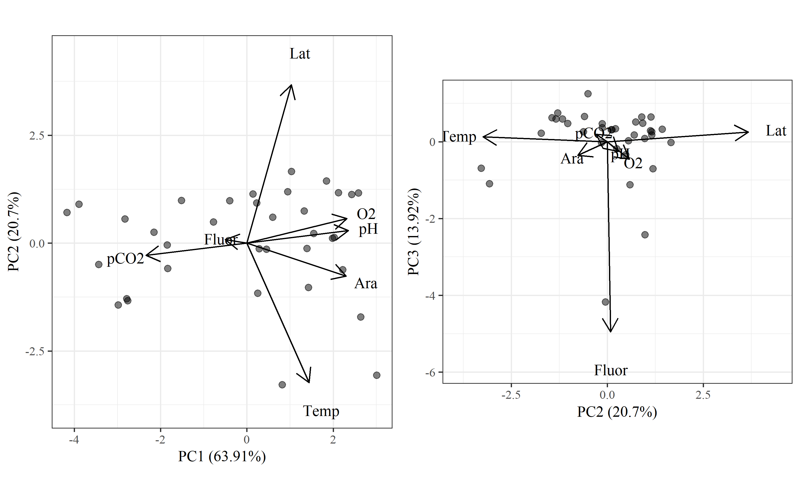
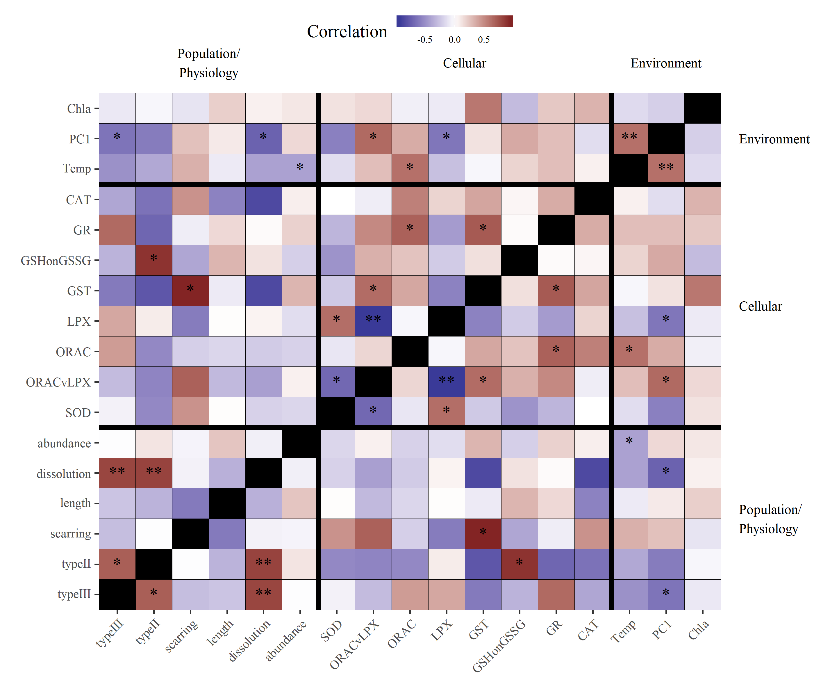

---
output:
  html_document:
    keep_md: yes
    self_contained: yes
code_folding: hide
---
  


### Principal components analysis of all environmental variables.  


```r
p1 <- ggord(prmod, vec_ext = 5, size = 2, alpha = 0.5)
p2 <- ggord(prmod, axes = c(2, 3), vec_ext = 5, size = 2, alpha = 0.5)
grid.arrange(p1, p2, ncol = 2)
```



Axes 1, 2, and 3 explain ~ 99% of the variation among environmental parameters: axis one explain OA parameters, axis 2 explains temp/lat, and axis 3 explains fluorescence.

```r
prmod
```

```
## Standard deviations (1, .., p=7):
## [1] 2.11509695 1.20360832 0.98723976 0.27131963 0.15093134 0.07704397
## [7] 0.02681751
## 
## Rotation (n x k) = (7 x 7):
##               PC1         PC2         PC3         PC4         PC5
## Lat    0.20562716  0.73425827  0.05087481  0.59482797  0.23029731
## pCO2  -0.46773206 -0.05676662  0.03873753  0.40794819 -0.14535576
## pH     0.47045498  0.05813897 -0.05030346 -0.09141589 -0.22012966
## Ara    0.45910384 -0.15276880 -0.07087649  0.30180848 -0.70274517
## O2     0.46266881  0.11433021 -0.09081982 -0.35335479  0.37760102
## Temp   0.28781117 -0.64619979  0.02501449  0.49988234  0.48875995
## Fluor -0.09971095  0.01668360 -0.98968847  0.07463762  0.04536724
##               PC6          PC7
## Lat   -0.07477196 -0.059548456
## pCO2   0.61940949  0.453084460
## pH    -0.22447594  0.815817477
## Ara    0.22999355 -0.350750209
## O2     0.70468589 -0.024363867
## Temp  -0.09059833  0.044588545
## Fluor -0.05161680  0.001688854
```

```r
summary(prmod)
```

```
## Importance of components:
##                           PC1    PC2    PC3     PC4     PC5     PC6
## Standard deviation     2.1151 1.2036 0.9872 0.27132 0.15093 0.07704
## Proportion of Variance 0.6391 0.2069 0.1392 0.01052 0.00325 0.00085
## Cumulative Proportion  0.6391 0.8460 0.9853 0.99579 0.99905 0.99990
##                            PC7
## Standard deviation     0.02682
## Proportion of Variance 0.00010
## Cumulative Proportion  1.00000
```

###  Correlation plot

The OA parameters oxygen, pH, aragonite saturation, and pCO2 were replaced with the first principal component axis for the correlation plot. 


```r
# physiology rda model
PC1 <- prmod$x[, 'PC1'] %>% 
  data.frame(PC1 = .) %>% 
  rownames_to_column('CTD') %>% 
  mutate(CTD = as.numeric(CTD))

dat_cor <- ptedat %>% 
  select(one_of('CTD', phychr, biochr)) %>% 
  # na.omit %>% 
  left_join(envdat, by = 'CTD') %>% 
  data.frame %>% 
  remove_rownames %>% 
  left_join(PC1, by = 'CTD') %>% 
  column_to_rownames('CTD') %>% 
  select(-Ara, -pCO2, -O2, -pH, -Lat)

# all correlations
crs <- crossing(var1 = names(dat_cor), var2 = names(dat_cor)) %>%
  filter(var1 != var2) %>%
  rownames_to_column() %>%
  group_by(rowname) %>%
  nest %>%
  mutate(
    crs = map(data, function(x){

      # variables
      vr1 <- dat_cor[[x$var1]]
      vr2 <- dat_cor[[x$var2]]

      # pearson
      pr_ts <- cor.test(vr1, vr2, method = 'pearson')
      pr_cr <- round(pr_ts$estimate, 2)
      pr_pv <- p_ast(pr_ts$p.value)
      pr <- paste(pr_cr, pr_pv)

      out <- data.frame(pr = pr, stringsAsFactors = F)
      return(out)

    })
  ) %>%
  unnest %>%
  select(-rowname)

levs <- c("Fluor", "PC1", "Temp", sort(biochr), sort(phychr))
labs <- c('Chla', 'PC1', 'Temp', 'CAT', 'GR', 'GSHonGSSG', 'GST', ' LPX', 'ORAC', 'ORACvLPX', 'SOD', 'abundance', 'dissolution', 'length', 'scarring', 'typeII', 'typeIII')
prplo <- crs %>%
  separate(pr, c('cor', 'sig'), sep = ' ') %>%
  filter(var1 %in% levs & var2 %in% levs) %>%
  mutate(
    cor = as.numeric(cor),
    var1 = factor(var1, levels = rev(levs), labels = rev(labs)),
    var2 = factor(var2, levels = rev(levs), labels = rev(labs)),
    sig = gsub('ns', '', sig)
  )

pbase <- theme(
  panel.grid.major = element_blank(),
  panel.grid.minor = element_blank(),
  axis.text.x = element_text(angle = 45, hjust = 1, vjust = 1, size = 8),
  axis.text.y = element_text(size = 8),
  legend.position = c(0.5, 1.12),
  legend.direction = 'horizontal',
  plot.margin = unit(c(4,4,0,0), "lines"),
  strip.background = element_blank(),
  strip.text.y = element_text(angle = 0, hjust = 0, vjust = 0.5),
  panel.background = element_rect(fill = 'black')
)

outlab <- data.frame(
  y = c(3.5, 10.5, 16),
  lab = c('Population/\nPhysiology', 'Cellular', 'Environment')
)

p <- ggplot(prplo) +
  geom_tile(aes(y = var1, x = var2, fill = cor), colour = 'black') +
  geom_text(aes(y = var1, x = var2, label = sig)) +
  annotation_custom(grob = textGrob(label = outlab$lab[1], hjust = 0, gp = gpar(cex = 0.7)),
                    ymin = outlab$y[1], ymax = outlab$y[1], xmin = 18, xmax = 18) +
  annotation_custom(grob = textGrob(label = outlab$lab[2], hjust = 0, gp = gpar(cex = 0.7)),
                    ymin = outlab$y[2], ymax = outlab$y[2], xmin = 18, xmax = 18) +
  annotation_custom(grob = textGrob(label = outlab$lab[3], hjust = 0, gp = gpar(cex = 0.7)),
                    ymin = outlab$y[3], ymax = outlab$y[3], xmin = 18, xmax = 18) +
  annotation_custom(grob = textGrob(label = outlab$lab[1], hjust = 0.5, gp = gpar(cex = 0.7)),
                    xmin = outlab$y[1], xmax = outlab$y[1], ymin = 18.5, ymax = 18.5) +
  annotation_custom(grob = textGrob(label = outlab$lab[2], hjust = 0.5, gp = gpar(cex = 0.7)),
                    xmin = outlab$y[2], xmax = outlab$y[2], ymin = 18.5, ymax = 18.5) +
  annotation_custom(grob = textGrob(label = outlab$lab[3], hjust = 0.5, gp = gpar(cex = 0.7)),
                    xmin = outlab$y[3], xmax = outlab$y[3], ymin = 18.5, ymax = 18.5) +
  pbase +
  scale_y_discrete('', expand = c(0, 0), labels = parse(text = rev(labs))) +
  scale_x_discrete('', expand = c(0, 0), labels = parse(text = rev(labs))) +
  scale_fill_gradient2('Correlation', low = muted("blue"), mid = "white", high = muted("red"), midpoint = 0) +
  guides(fill = guide_colourbar(barheight = 0.5, barwidth = 5, label.theme = element_text(size = 6, angle = 0))) +
  geom_hline(yintercept = 6.5, size = 1.5) +
  geom_hline(yintercept = 14.5, size = 1.5) +
  geom_vline(xintercept = 6.5, size = 1.5) +
  geom_vline(xintercept = 14.5, size = 1.5)

# Code to override clipping
gt <- ggplot_gtable(ggplot_build(p))
gt$layout$clip[gt$layout$name == "panel"] <- "off"
grid.draw(gt)
```


