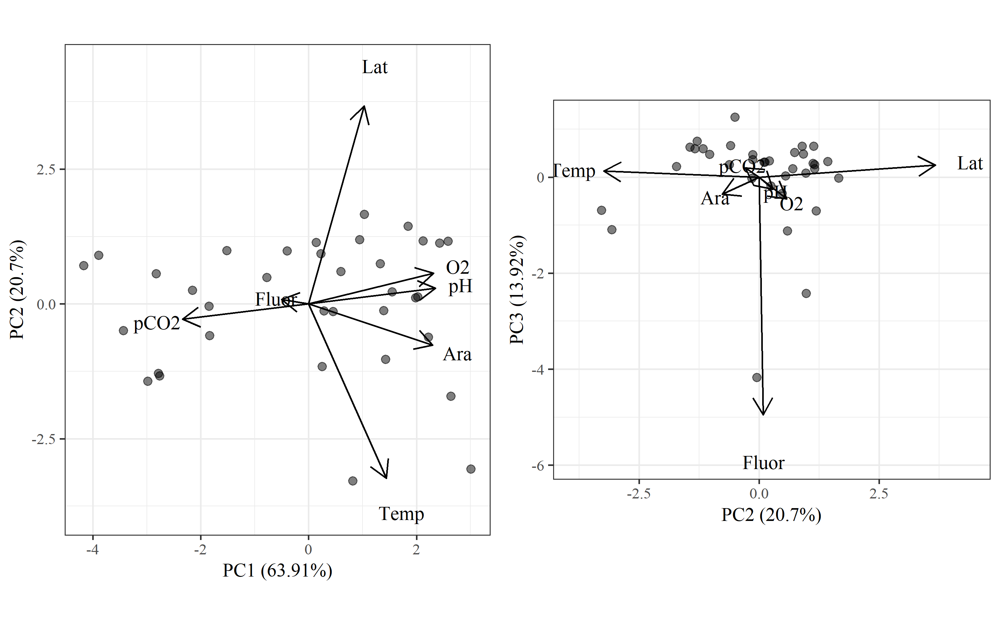
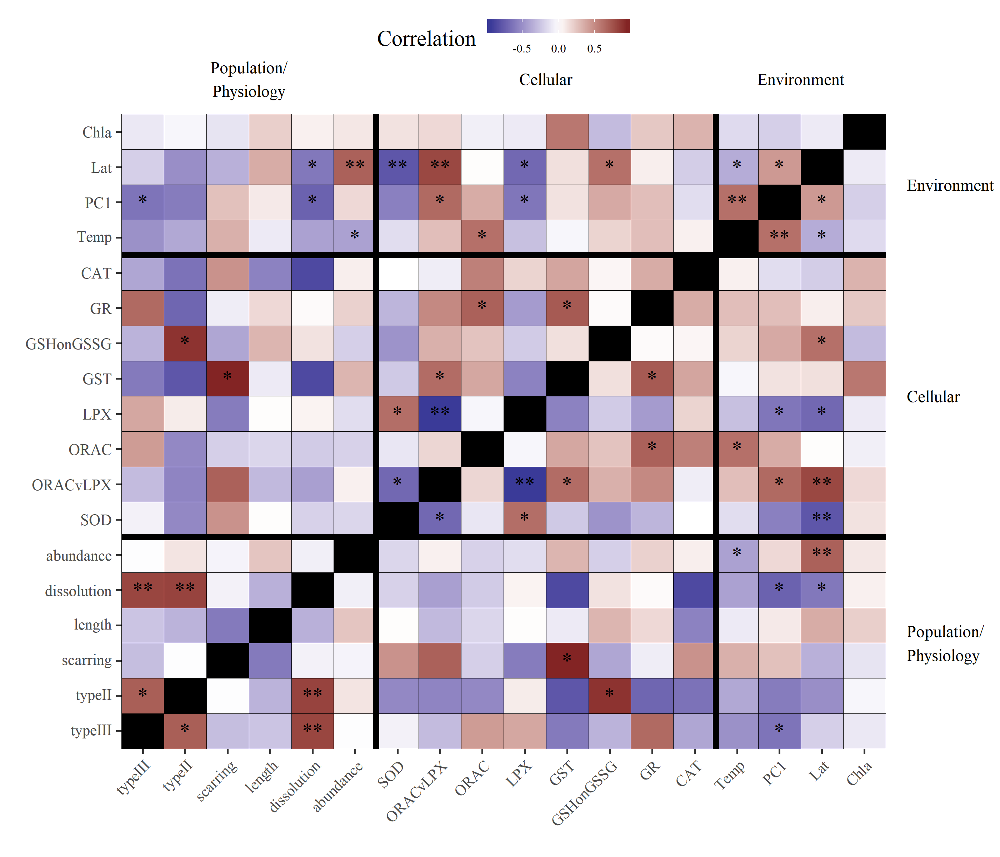

__The text addition to Methods section 2.4 is helpful, but it does not resolve my issue. I am specifically concerned about the statistical analyses behind Figure 5. I assume that these analyses were conducted using linear models for pairwise comparisons as described starting on p. 6, line 240. My argument remains that this is inappropriate, given that you found that some of the environmental variables were highly correlated in the exploratory RDA. Ultimately, the outcome may be similar and may not change your discussion and interpretation much, but I recommend redoing this part of the statistical analyses using collapsed variables that combine correlated environmental variables. For example, in the RDA, you found that carbonate chemistry parameters and dissolved oxygen are all highly correlated. Therefore, it is redundant and inappropriate to analyze their effects separately (separate rows and p-values in Figure 5). In that table, one variable that represents O2, pCO2, Omega_ar, and pH should presented (one row instead of four).__

__Furthermore, I think that latitude should be included in the RDA, as upwelling intensity generally increases with latitude in this system. Therefore, any correlations with abiotic varables and latitude should be identified and accounted for in the subsequent statistical analyses.__

We appreciate the concerns of the reviewer and we hope that our response here provides sufficient clarity on the intent of our analyses.  First and most importantly, we reiterate that the analysis in Figure 5 was presented to demonstrate exactly the issue that the reviewer notes and that the results jusified our conservative approach to screen collinear variables in the following analysis (i.e., those for Figs. 6 and 7).  Therefore, we feel there is value in presenting the correlations among all variables to emphasize the complexity of the system and to provide readers with an overview of associations that were more rigorously evaluated in the follow-up analysis.  The key distinction between figure 5 and the follow-up analyses is that we never claimed the results in figure 5 were causative.  Our conservative statistical design in the follow-up analyses provided us with a more solid foundation to infer mechanistic relationships. 

We also emphasize that the text noted by the reviewer on p. 6, line 240 was not the analysis used for Figure 5.  The pairwise comparisons using linear models were the follow-up analyses that exluded collinear variables.  The stars in figure 5 are simply the significance of correlation coefficients (i.e., an association). 

We feel there is still some disagreement about presenting correlation results in Figure 5 among multiple variables that co-vary, such as the parameters pH, pCO2, omega, and O2.  We recreated Figure 5 using the first principal component axis of a PCA of all environmental variables.  Nearly 100% of the variance was described by the first three axes: axis one explained the OA parameters pCO2, pH, O2, and Omega, axis 2 explained temperature and latitude, and axis 3 explained fluorescence.   

Figure: Results of principal components analysis of the environmental data.  The first plot shows the estimated axis scores for the first and second principal components and the second plot shows the scores for the second and third principal components.  The first three axes explained nearly 99% of the variation among the observations.  Length and direction of each vector shows the relative loadings of each variable with the axes.

The first axis above was used in place of the four correlated OA parameters in the original Figure 5:          

Figure: Modified correlation matrix of environmental variables, cellular response endpoints, and population (abundance) and physiological response endpoints for pteropods.  Correlated environmental variables related to ocean acidification were combined into a single principal component axis represented by PC1.  Darker red values are strong positive correlations and darker purple values are strong negative correlations.  Significance values at alpha = 0.05 are shown by stars (p < 0.05 \*, p < 0.005 \*\*).

Although this addresses the reviewer's concern, we feel this presentation complicates evaluation of the study system.  A reader would have to know which variables were described by PC1 and the approximate loadings.  We feel this presentation lacks the transparency provided by the original figure, nor does it change any of our conclusions.

Further, we want to emphasize the unique variation explained by latitude that was not associated with the OA parameters.  The loadings on the PC axes show a distinct separation of latitude on the second axis and the OA parameters on the first.  Therefore, we argue that latitude does not confound our interpration of pteropod response to acidification.  

It is further noted that latitude is weakly associated with PC1 in the updated Figure 5, although this assocation is weak compared to the association with temperature.  Our PCA demonstrated that latitude is primarily associated with temperature and we did not include latitude in follow-up analyses because of no mechanistic interpretation on pteropod response.  We felt it unnecessary to include latitude in the RDA as a specific variable, but instead showed the points sized relative to latitude to emphasize the weak association.  We are confident that our exclusion of latitude from the analysis does not affect our conclusions.   
