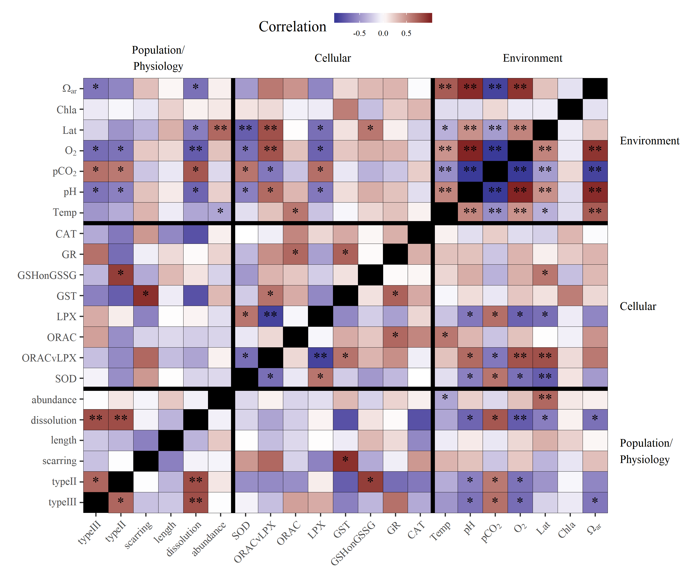

---
output:
  html_document:
    keep_md: yes
    self_contained: no
    code_folding: hide
    css: styles.css
---

<a href="https://github.com/fawda123/Pteropod_biomarker/" class="github-corner" aria-label="View source on Github"><svg width="80" height="80" viewBox="0 0 250 250" style="fill:#FD6C6C; color:#fff; position: absolute; top: 0; border: 0; left: 0; transform: scale(-1, 1);" aria-hidden="true"><path d="M0,0 L115,115 L130,115 L142,142 L250,250 L250,0 Z"></path><path d="M128.3,109.0 C113.8,99.7 119.0,89.6 119.0,89.6 C122.0,82.7 120.5,78.6 120.5,78.6 C119.2,72.0 123.4,76.3 123.4,76.3 C127.3,80.9 125.5,87.3 125.5,87.3 C122.9,97.6 130.6,101.9 134.4,103.2" fill="currentColor" style="transform-origin: 130px 106px;" class="octo-arm"></path><path d="M115.0,115.0 C114.9,115.1 118.7,116.5 119.8,115.4 L133.7,101.6 C136.9,99.2 139.9,98.4 142.2,98.6 C133.8,88.0 127.5,74.4 143.8,58.0 C148.5,53.4 154.0,51.2 159.7,51.0 C160.3,49.4 163.2,43.6 171.4,40.1 C171.4,40.1 176.1,42.5 178.8,56.2 C183.1,58.6 187.2,61.8 190.9,65.4 C194.5,69.0 197.7,73.2 200.1,77.6 C213.8,80.2 216.3,84.9 216.3,84.9 C212.7,93.1 206.9,96.0 205.4,96.6 C205.1,102.4 203.0,107.8 198.3,112.5 C181.9,128.9 168.3,122.5 157.7,114.1 C157.9,116.9 156.7,120.9 152.7,124.9 L141.0,136.5 C139.8,137.7 141.6,141.9 141.8,141.8 Z" fill="currentColor" class="octo-body"></path></svg></a><style>.github-corner:hover .octo-arm{animation:octocat-wave 560ms ease-in-out}@keyframes octocat-wave{0%,100%{transform:rotate(0)}20%,60%{transform:rotate(-25deg)}40%,80%{transform:rotate(10deg)}}@media (max-width:500px){.github-corner:hover .octo-arm{animation:none}.github-corner .octo-arm{animation:octocat-wave 560ms ease-in-out}}</style>

# Pteropod stressor interaction: figures
  

```r
library(tidyverse)
library(vegan)
library(ggord)
library(scales)
library(effects)
library(knitr)
library(gridExtra)
library(grid)
library(stargazer)

source("R/funcs.R")

opts_chunk$set(fig.align = 'center', message = F, echo = T, cache = F, dev = 'png', dev.args = list(family = 'serif'), dpi = 400, fig.pos = '!h', warning = F, background = 'white', out.width = '100%',
               fig.process = function(x) {
                 x2 = sub('-\\d+([.][a-z]+)$', '\\1', x)
                 if (file.rename(x, x2)) x2 else x
               })

data(envdat)
data(ptedat)
data(phymod)
data(biomod)

envchr <- c('Lat', 'pCO2', 'pH', 'Ara', 'O2', 'Temp', 'Fluor')
biochr <- c('CAT', 'GR', 'GSHonGSSG', 'GST', 'LPX', 'ORAC', 'SOD', 'ORACvLPX')
phychr <- c('abu', 'dis', 'len', 'ty2', 'ty3', 'scr')
```


```r
# biomarker rda model
dat_bio <- ptedat %>% 
  select(one_of('CTD', biochr)) %>% 
  na.omit %>% 
  inner_join(envdat, by = 'CTD') %>% 
  select(one_of(c('CTD', envchr, biochr))) %>% 
  data.frame %>% 
  remove_rownames %>% 
  column_to_rownames('CTD')

envphy <- select(dat_bio, one_of(envchr)) %>% 
  select(-Lat) %>% 
  decostand(method = 'range')
ptephy <- select(dat_bio, one_of(biochr)) %>% 
  decostand(method = 'range')

biorda<- rda(ptephy, envphy)

# physiology rda model
dat_phy <- ptedat %>% 
  select(one_of('CTD', phychr)) %>% 
  na.omit %>% 
  inner_join(envdat, by = 'CTD') %>% 
  select(one_of(c('CTD', envchr, phychr))) %>% 
  data.frame %>% 
  remove_rownames %>% 
  column_to_rownames('CTD')

envphy <- select(dat_phy, one_of(envchr)) %>% 
  select(-Lat) %>% 
  decostand(method = 'range')
ptephy <- select(dat_phy, one_of(phychr)) %>% 
  decostand(method = 'range')

phyrda <- rda(ptephy, envphy)
```


```r
# globals
coord_fix <- F
repel <- F
addsize <- 3
alpha <- 0.8
arrow <- 0.3
cols <- 'lightblue'

p1a <- ggord(biorda, ptslab = T, parse = T, repel = repel, coord_fix = coord_fix, addsize = addsize, size = dat_bio$Lat, sizelab = 'Latitude', alpha = alpha, arrow = arrow, ellipse = F) + 
  ggtitle('(a) Cellular endpoints')
p2a <- ggord(phyrda, ptslab = T, parse = T, repel = repel, coord_fix = coord_fix, addsize = addsize, size = dat_phy$Lat, sizelab = 'Latitude', alpha = alpha, arrow = arrow, ellipse = F) + 
  ggtitle('(b) Physiological endpoints')

grid.arrange(p1a, p2a, ncol = 2)
```


Fig. 1 Results of redundancy analyses for environmental variables with (a) cellular and (b) physiological endpoints of pteropod response to OA stressors.  Points are site locations in multivariate space with the size proportional to latitude. Separate RDAs were created for cellular and physiological endpoints because not all data were available across all stations.   


```r
# physiology rda model
dat_cor <- ptedat %>% 
  select(one_of('CTD', phychr, biochr)) %>% 
  # na.omit %>% 
  left_join(envdat, by = 'CTD') %>% 
  data.frame %>% 
  remove_rownames %>% 
  column_to_rownames('CTD')

# all correlations
crs <- crossing(var1 = names(dat_cor), var2 = names(dat_cor)) %>% 
  filter(var1 != var2) %>% 
  rownames_to_column() %>% 
  group_by(rowname) %>% 
  nest %>% 
  mutate(
    crs = map(data, function(x){
      
      # variables
      vr1 <- dat_cor[[x$var1]]
      vr2 <- dat_cor[[x$var2]]
      
      # pearson
      pr_ts <- cor.test(vr1, vr2, method = 'pearson')
      pr_cr <- round(pr_ts$estimate, 2)
      pr_pv <- p_ast(pr_ts$p.value)
      pr <- paste(pr_cr, pr_pv)
    
      out <- data.frame(pr = pr, stringsAsFactors = F)
      return(out)
      
    })
  ) %>% 
  unnest %>% 
  select(-rowname)
```


```r
levs <- c(sort(envchr), sort(biochr), sort(phychr))
labs <- c('Omega[ar]', 'chla', 'Lat', 'O[2]', 'pCO[2]', 'pH', 'Temp', 'CAT', 'GR', 'GSHonGSSG', 'GST', ' LPX', 'ORAC', 'ORACvLPX', 'SOD', 'abundance', 'dissolution', 'growth', 'scarring', 'typeII', 'typeIII')
prplo <- crs %>% 
  separate(pr, c('cor', 'sig'), sep = ' ') %>% 
  filter(var1 %in% levs & var2 %in% levs) %>%  
  mutate(
    cor = as.numeric(cor), 
    var1 = factor(var1, levels = rev(levs), labels = rev(labs)), 
    var2 = factor(var2, levels = rev(levs), labels = rev(labs)), 
    sig = gsub('ns', '', sig)
  )

pbase <- theme(
  panel.grid.major = element_blank(), 
  panel.grid.minor = element_blank(), 
  axis.text.x = element_text(angle = 45, hjust = 1, vjust = 1, size = 8), 
  axis.text.y = element_text(size = 8),
  legend.position = c(0.5, 1.12),
  legend.direction = 'horizontal',
  plot.margin = unit(c(4,4,0,0), "lines"),
  strip.background = element_blank(), 
  strip.text.y = element_text(angle = 0, hjust = 0, vjust = 0.5), 
  panel.background = element_rect(fill = 'black')
  ) 

outlab <- data.frame(
  y = c(3.5, 10.5, 18.5), 
  lab = c('Population/\nPhysiology', 'Cellular', 'Environment')
)

p <- ggplot(prplo) + 
  geom_tile(aes(y = var1, x = var2, fill = cor), colour = 'black') + 
  geom_text(aes(y = var1, x = var2, label = sig)) +
  annotation_custom(grob = textGrob(label = outlab$lab[1], hjust = 0, gp = gpar(cex = 0.7)),
                    ymin = outlab$y[1], ymax = outlab$y[1], xmin = 22, xmax = 22) +
  annotation_custom(grob = textGrob(label = outlab$lab[2], hjust = 0, gp = gpar(cex = 0.7)),
                    ymin = outlab$y[2], ymax = outlab$y[2], xmin = 22, xmax = 22) +  
  annotation_custom(grob = textGrob(label = outlab$lab[3], hjust = 0, gp = gpar(cex = 0.7)),
                    ymin = outlab$y[3], ymax = outlab$y[3], xmin = 22, xmax = 22) +
  annotation_custom(grob = textGrob(label = outlab$lab[1], hjust = 0.5, gp = gpar(cex = 0.7)),
                    xmin = outlab$y[1], xmax = outlab$y[1], ymin = 22.5, ymax = 22.5) +
  annotation_custom(grob = textGrob(label = outlab$lab[2], hjust = 0.5, gp = gpar(cex = 0.7)),
                    xmin = outlab$y[2], xmax = outlab$y[2], ymin = 22.5, ymax = 22.5) +  
  annotation_custom(grob = textGrob(label = outlab$lab[3], hjust = 0.5, gp = gpar(cex = 0.7)),
                    xmin = outlab$y[3], xmax = outlab$y[3], ymin = 22.5, ymax = 22.5) +
  pbase +
  scale_y_discrete('', expand = c(0, 0), labels = parse(text = rev(labs))) + 
  scale_x_discrete('', expand = c(0, 0), labels = parse(text = rev(labs))) +
  scale_fill_gradient2('Correlation', low = muted("blue"), mid = "white", high = muted("red"), midpoint = 0) +
  guides(fill = guide_colourbar(barheight = 0.5, barwidth = 5, label.theme = element_text(size = 6, angle = 0))) +
  geom_hline(yintercept = 6.5, size = 1.5) +
  geom_hline(yintercept = 14.5, size = 1.5) +
  geom_vline(xintercept = 6.5, size = 1.5) +
  geom_vline(xintercept = 14.5, size = 1.5) 

# Code to override clipping
gt <- ggplot_gtable(ggplot_build(p))
gt$layout$clip[gt$layout$name == "panel"] <- "off"
grid.draw(gt)
```


Fig. 2 Correlation matrix of environmental variables, cellular response endpoints, and population (abundance) and physiological response endpoints for pteropods.  Darker red values are strong positive correlations and darker purple values are strong negative correlations.  Significance values at alpha = 0.05 are shown by stars (p < 0.05 \*, p < 0.005 \*).


```r
# cellular 92 (lpx, ara, ph - syn), 101 (lpx, ara, t - neg add), 164 (sod, ara, t, neg but no thrsh) 
biosel <- biomod %>% 
  filter(Model %in% paste0('mod', c(92, 101, 164))) %>% 
  dplyr::select(-data)

cols <- RColorBrewer::brewer.pal(9, 'RdBu')

##
# plots

# mod 92 cell (lpx, ara, ph - syn)
pl1 <- filter(biosel, grepl('92$', Model)) %>% 
  .$Modobj %>% 
  .[[1]] %>% 
  get_pldat(., 'pH')

p1 <- ggplot() +
  geom_ribbon(data = pl1[[1]], aes(x = Ara, ymin = LPX - se.fit, ymax = LPX + se.fit, group = pH), alpha = 0.5, fill = 'grey') +
  geom_line(data = pl1[[1]], aes(x = Ara, y = LPX, group = pH, colour = pH), size = 1) + 
  geom_text(data = pl1[[2]], aes(x= x, y = y, label = lab), hjust = 0) +
  theme_bw() +
  scale_x_continuous(expression(Omega[Ar])) +
  scale_colour_gradientn(colours = cols) + 
  scale_y_continuous('LPX') +
  ggtitle("(a) Synergistic effect of pH on aragonite\nsaturation")

# mod 101 cell (lpx, ara, t - neg add), 164 (sod, ara, t, neg but no thrsh) 
pl2 <- filter(biosel, grepl('101$', Model)) %>% 
  .$Modobj %>% 
  .[[1]] %>% 
  get_pldat(., 'Temp')

p2 <- ggplot() +
    geom_ribbon(data = pl2[[1]], aes(x = Ara, ymin = LPX - se.fit, ymax = LPX + se.fit, group = Temp), alpha = 0.5, fill = 'grey') +
  geom_line(data = pl2[[1]], aes(x = Ara, y = LPX, group = Temp, colour = Temp), size = 1) + 
  geom_text(data = pl2[[2]], aes(x= x, y = y, label = lab), hjust = 0) +
  theme_bw() +
  scale_x_continuous(expression(Omega[Ar])) +
  scale_colour_gradientn(colours = cols) + 
  scale_y_continuous('LPX') +
  ggtitle("(b) Negative additive effect below threshold of\n temperature on aragonite saturation")

# mod 164 cell (sod, ara, t, neg but no thrsh) 
pl3 <- filter(biosel, grepl('164$', Model)) %>% 
  .$Modobj %>% 
  .[[1]] %>% 
  get_pldat(., 'Temp')

p3 <- ggplot() +
    geom_ribbon(data = pl3[[1]], aes(x = Ara, ymin = SOD - se.fit, ymax = SOD + se.fit, group = Temp), alpha = 0.5, fill = 'grey') +
  geom_line(data = pl3[[1]], aes(x = Ara, y = SOD, group = Temp, colour = Temp), size = 1) + 
  geom_text(data = pl3[[2]], aes(x= x, y = y, label = lab), hjust = 0) +
  theme_bw() +
  scale_x_continuous(expression(Omega[Ar])) +
  scale_colour_gradientn(colours = cols) + 
  scale_y_continuous('SOD') +
  ggtitle("(c) Negative additive effect of temperature on \naragonite saturation")

grid.arrange(p1, p2, p3, ncol = 2)
```
<!-- Fig. 3 Examples of model interactions of co-occuring environmental variables on cellular response measures.  Each subplot shows a different relationship as either additive or synergistic effects between the variables. All y-axes are transformed to conform to model output. Covarying environmental variables were held constant at the minimum, 25th, median, 75th, and maximum values in the observed data. -->


```r
# physio 4 (abu, o2, pco2 - pos additive), 38 (dis, ara, t - syn)
physel <- phymod %>% 
  filter(Model %in% paste0('mod', c(4, 38))) %>% 
  dplyr::select(-data)

cols <- RColorBrewer::brewer.pal(9, 'RdBu')

# mod 4 physio (abu, o2, pco2 - pos additive)
pl4 <- filter(physel, grepl('4$', Model)) %>% 
  .$Modobj %>% 
  .[[1]] %>% 
  get_pldat(., 'pCO2', fct = 0.9)

p4 <- ggplot() +
  geom_ribbon(data = pl4[[1]], aes(x = O2, ymin = abu - se.fit, ymax = abu + se.fit, group = pCO2), alpha = 0.5, fill = 'grey') +
  geom_line(data = pl4[[1]], aes(x = O2, y = abu, group = pCO2, colour = pCO2), size = 1) + 
  geom_text(data = pl4[[2]], aes(x= x, y = y, label = lab), hjust = 0) +
  theme_bw() +
  scale_colour_gradientn(colours = cols) + 
  scale_y_continuous('Abundance') +
  ggtitle("(a) Synergistic effect of O2 on\npCO2 stress")

# mod 38 physio (dis, ara, t - syn)
pl5 <- filter(physel, grepl('38$', Model)) %>% 
  .$Modobj %>% 
  .[[1]] %>% 
  get_pldat(., 'Temp', 'right', fct = 1.05)

p5 <- ggplot() +
  geom_ribbon(data = pl5[[1]], aes(x = Ara, ymin = dis - se.fit, ymax = dis + se.fit, group = Temp), alpha = 0.5, fill = 'grey') +
  geom_line(data = pl5[[1]], aes(x = Ara, y = dis, group = Temp, colour = Temp), size = 1) + 
  geom_text(data = pl5[[2]], aes(x= x, y = y, label = lab), hjust = 1) +
  theme_bw() +
  scale_colour_gradientn(colours = cols) + 
  scale_y_continuous('Shell dissolution') +
  scale_x_continuous(expression(Omega[Ar])) +
  ggtitle("(b) Synergistic effect of temperature on \naragonite saturation")

grid.arrange(p4, p5, ncol = 2)
```
<!-- Fig. 4 Examples of model interactions of co-occuring environmental variables on abundance and shell dissolution. Each subplot shows a different relationship as either additive or synergistic effects between the variables. All y-axes are transformed to conform to model output. Covarying environmental variables were held constant at the minimum, 25th, median, 75th, and maximum values in the observed data. -->


```r
biotab <- biomod %>% 
  unnest(data) %>% 
  group_by(Model) %>% 
  mutate(n = n()) %>% 
  filter(n > 1) %>% 
  dplyr::select(-n)
biotab <- filter(biomod, Model %in% unique(biotab$Model))

cap <- 'Table 1: Model results for pteropod cellular response to pairs of co-occurring environmental variables. The estimated joint effects of variables and their significance in each model are shown.  Parameter estimates with standard errors (in parentheses) are included with overall model statistics (R-squared, F statistic) at the bottom. Models with the same cellular response measure can be identified with the column names at the top.'

stargazer(biotab$Modobj, type = 'html', title = cap, digits = 2, keep.stat = c('adj.rsq'), intercept.top = T, intercept.bottom = F, dep.var.caption = 'Cellular response measures')
```


<table style="text-align:center"><caption><strong>Table 1: Model results for pteropod cellular response to pairs of co-occurring environmental variables. The estimated joint effects of variables and their significance in each model are shown. Parameter estimates with standard errors (in parentheses) are included with overall model statistics (R-squared, F statistic) at the bottom. Models with the same cellular response measure can be identified with the column names at the top.</strong></caption>
<tr><td colspan="9" style="border-bottom: 1px solid black"></td></tr><tr><td style="text-align:left"></td><td colspan="8">Cellular response measures</td></tr>
<tr><td></td><td colspan="8" style="border-bottom: 1px solid black"></td></tr>
<tr><td style="text-align:left"></td><td colspan="2">LPX</td><td>ORAC</td><td colspan="3">ORACvLPX</td><td colspan="2">SOD</td></tr>
<tr><td style="text-align:left"></td><td>(1)</td><td>(2)</td><td>(3)</td><td>(4)</td><td>(5)</td><td>(6)</td><td>(7)</td><td>(8)</td></tr>
<tr><td colspan="9" style="border-bottom: 1px solid black"></td></tr><tr><td style="text-align:left">Constant</td><td>-2.00<sup>*</sup></td><td>-2.46</td><td>-460.05<sup>*</sup></td><td>206.22<sup>***</sup></td><td>232.37<sup>*</sup></td><td>-141.36<sup>**</sup></td><td>-126.74<sup>*</sup></td><td>-30.67</td></tr>
<tr><td style="text-align:left"></td><td>(0.87)</td><td>(4.70)</td><td>(226.47)</td><td>(15.04)</td><td>(108.53)</td><td>(55.82)</td><td>(60.05)</td><td>(42.59)</td></tr>
<tr><td style="text-align:left"></td><td></td><td></td><td></td><td></td><td></td><td></td><td></td><td></td></tr>
<tr><td style="text-align:left">Fluor</td><td>-11.07<sup>***</sup></td><td></td><td></td><td>320.02<sup>***</sup></td><td></td><td>256.12<sup>**</sup></td><td></td><td></td></tr>
<tr><td style="text-align:left"></td><td>(3.07)</td><td></td><td></td><td>(52.80)</td><td></td><td>(87.68)</td><td></td><td></td></tr>
<tr><td style="text-align:left"></td><td></td><td></td><td></td><td></td><td></td><td></td><td></td><td></td></tr>
<tr><td style="text-align:left">pCO2</td><td>0.01<sup>***</sup></td><td></td><td>0.39<sup>**</sup></td><td>-0.27<sup>***</sup></td><td></td><td></td><td>0.10<sup>***</sup></td><td></td></tr>
<tr><td style="text-align:left"></td><td>(0.002)</td><td></td><td>(0.16)</td><td>(0.03)</td><td></td><td></td><td>(0.03)</td><td></td></tr>
<tr><td style="text-align:left"></td><td></td><td></td><td></td><td></td><td></td><td></td><td></td><td></td></tr>
<tr><td style="text-align:left">Ara</td><td></td><td>-8.43<sup>**</sup></td><td>278.81<sup>**</sup></td><td></td><td>227.87<sup>***</sup></td><td>132.98<sup>***</sup></td><td></td><td>-80.21<sup>***</sup></td></tr>
<tr><td style="text-align:left"></td><td></td><td>(2.61)</td><td>(92.45)</td><td></td><td>(60.31)</td><td>(32.14)</td><td></td><td>(23.67)</td></tr>
<tr><td style="text-align:left"></td><td></td><td></td><td></td><td></td><td></td><td></td><td></td><td></td></tr>
<tr><td style="text-align:left">Temp</td><td></td><td>1.82<sup>*</sup></td><td></td><td></td><td>-50.51<sup>**</sup></td><td></td><td>11.24<sup>*</sup></td><td>19.58<sup>**</sup></td></tr>
<tr><td style="text-align:left"></td><td></td><td>(0.80)</td><td></td><td></td><td>(18.49)</td><td></td><td>(4.89)</td><td>(7.26)</td></tr>
<tr><td style="text-align:left"></td><td></td><td></td><td></td><td></td><td></td><td></td><td></td><td></td></tr>
<tr><td colspan="9" style="border-bottom: 1px solid black"></td></tr><tr><td style="text-align:left">Adjusted R<sup>2</sup></td><td>0.72</td><td>0.50</td><td>0.46</td><td>0.87</td><td>0.58</td><td>0.61</td><td>0.54</td><td>0.50</td></tr>
<tr><td colspan="9" style="border-bottom: 1px solid black"></td></tr><tr><td style="text-align:left"><em>Note:</em></td><td colspan="8" style="text-align:right"><sup>*</sup>p<0.1; <sup>**</sup>p<0.05; <sup>***</sup>p<0.01</td></tr>
</table>


```r
phytab <- phymod %>% 
  unnest(data) %>% 
  group_by(Model) %>% 
  mutate(n = n()) %>% 
  filter(n > 1) %>% 
  dplyr::select(-n)
phytab <- filter(phymod, Model %in% unique(phytab$Model))

cap <- 'Table 2: Model results for physiological and abundance responses to pairs of co-occurring environmental variables. The estimated joint effects of variables and their significance in each model are shown.  Parameter estimates with standard errors (in parentheses) are included with overall model statistics (R-squared, F statistic) at the bottom. Models with the same response measure can be identified with the column names at the top.'

stargazer(phytab$Modobj, type = 'html', title = cap, digits = 2, keep.stat = c('adj.rsq'), intercept.top = T, intercept.bottom = F, dep.var.caption = 'Physiological response measures', dep.var.labels = c('Abundance', 'Shell dissolution'))
```


<table style="text-align:center"><caption><strong>Table 2: Model results for physiological and abundance responses to pairs of co-occurring environmental variables. The estimated joint effects of variables and their significance in each model are shown. Parameter estimates with standard errors (in parentheses) are included with overall model statistics (R-squared, F statistic) at the bottom. Models with the same response measure can be identified with the column names at the top.</strong></caption>
<tr><td colspan="9" style="border-bottom: 1px solid black"></td></tr><tr><td style="text-align:left"></td><td colspan="8">Physiological response measures</td></tr>
<tr><td></td><td colspan="8" style="border-bottom: 1px solid black"></td></tr>
<tr><td style="text-align:left"></td><td colspan="4">Abundance</td><td colspan="4">Shell dissolution</td></tr>
<tr><td style="text-align:left"></td><td>(1)</td><td>(2)</td><td>(3)</td><td>(4)</td><td>(5)</td><td>(6)</td><td>(7)</td><td>(8)</td></tr>
<tr><td colspan="9" style="border-bottom: 1px solid black"></td></tr><tr><td style="text-align:left">Constant</td><td>4.58<sup>***</sup></td><td>2.73<sup>***</sup></td><td>0.14</td><td>1.96<sup>***</sup></td><td>-0.12<sup>***</sup></td><td>1.51<sup>*</sup></td><td>1.01<sup>***</sup></td><td>1.82<sup>**</sup></td></tr>
<tr><td style="text-align:left"></td><td>(0.83)</td><td>(0.51)</td><td>(0.42)</td><td>(0.55)</td><td>(0.03)</td><td>(0.64)</td><td>(0.22)</td><td>(0.62)</td></tr>
<tr><td style="text-align:left"></td><td></td><td></td><td></td><td></td><td></td><td></td><td></td><td></td></tr>
<tr><td style="text-align:left">Fluor</td><td></td><td></td><td></td><td></td><td>-0.33<sup>**</sup></td><td></td><td></td><td></td></tr>
<tr><td style="text-align:left"></td><td></td><td></td><td></td><td></td><td>(0.13)</td><td></td><td></td><td></td></tr>
<tr><td style="text-align:left"></td><td></td><td></td><td></td><td></td><td></td><td></td><td></td><td></td></tr>
<tr><td style="text-align:left">pCO2</td><td>-0.002<sup>***</sup></td><td></td><td></td><td></td><td>0.0004<sup>***</sup></td><td></td><td></td><td></td></tr>
<tr><td style="text-align:left"></td><td>(0.0005)</td><td></td><td></td><td></td><td>(0.0001)</td><td></td><td></td><td></td></tr>
<tr><td style="text-align:left"></td><td></td><td></td><td></td><td></td><td></td><td></td><td></td><td></td></tr>
<tr><td style="text-align:left">Ara</td><td></td><td>1.45<sup>***</sup></td><td>-1.54<sup>**</sup></td><td></td><td></td><td>-1.27<sup>***</sup></td><td>-0.41<sup>*</sup></td><td></td></tr>
<tr><td style="text-align:left"></td><td></td><td>(0.30)</td><td>(0.67)</td><td></td><td></td><td>(0.33)</td><td>(0.22)</td><td></td></tr>
<tr><td style="text-align:left"></td><td></td><td></td><td></td><td></td><td></td><td></td><td></td><td></td></tr>
<tr><td style="text-align:left">Temp</td><td>-0.31<sup>***</sup></td><td>-0.44<sup>***</sup></td><td></td><td>-0.30<sup>***</sup></td><td></td><td>-0.11</td><td></td><td>-0.15<sup>*</sup></td></tr>
<tr><td style="text-align:left"></td><td>(0.06)</td><td>(0.07)</td><td></td><td>(0.06)</td><td></td><td>(0.08)</td><td></td><td>(0.07)</td></tr>
<tr><td style="text-align:left"></td><td></td><td></td><td></td><td></td><td></td><td></td><td></td><td></td></tr>
<tr><td style="text-align:left">O2:Temp</td><td></td><td></td><td></td><td></td><td></td><td></td><td></td><td>0.001<sup>**</sup></td></tr>
<tr><td style="text-align:left"></td><td></td><td></td><td></td><td></td><td></td><td></td><td></td><td>(0.0003)</td></tr>
<tr><td style="text-align:left"></td><td></td><td></td><td></td><td></td><td></td><td></td><td></td><td></td></tr>
<tr><td style="text-align:left">O2</td><td></td><td></td><td>0.01<sup>**</sup></td><td>0.01<sup>***</sup></td><td></td><td></td><td>-0.01<sup>***</sup></td><td>-0.01<sup>***</sup></td></tr>
<tr><td style="text-align:left"></td><td></td><td></td><td>(0.005)</td><td>(0.002)</td><td></td><td></td><td>(0.001)</td><td>(0.002)</td></tr>
<tr><td style="text-align:left"></td><td></td><td></td><td></td><td></td><td></td><td></td><td></td><td></td></tr>
<tr><td style="text-align:left">Ara:Temp</td><td></td><td></td><td></td><td></td><td></td><td>0.10<sup>**</sup></td><td></td><td></td></tr>
<tr><td style="text-align:left"></td><td></td><td></td><td></td><td></td><td></td><td>(0.04)</td><td></td><td></td></tr>
<tr><td style="text-align:left"></td><td></td><td></td><td></td><td></td><td></td><td></td><td></td><td></td></tr>
<tr><td style="text-align:left">Ara:O2</td><td></td><td></td><td></td><td></td><td></td><td></td><td>0.002<sup>**</sup></td><td></td></tr>
<tr><td style="text-align:left"></td><td></td><td></td><td></td><td></td><td></td><td></td><td>(0.001)</td><td></td></tr>
<tr><td style="text-align:left"></td><td></td><td></td><td></td><td></td><td></td><td></td><td></td><td></td></tr>
<tr><td colspan="9" style="border-bottom: 1px solid black"></td></tr><tr><td style="text-align:left">Adjusted R<sup>2</sup></td><td>0.40</td><td>0.51</td><td>0.14</td><td>0.43</td><td>0.71</td><td>0.87</td><td>0.85</td><td>0.87</td></tr>
<tr><td colspan="9" style="border-bottom: 1px solid black"></td></tr><tr><td style="text-align:left"><em>Note:</em></td><td colspan="8" style="text-align:right"><sup>*</sup>p<0.1; <sup>**</sup>p<0.05; <sup>***</sup>p<0.01</td></tr>
</table>

